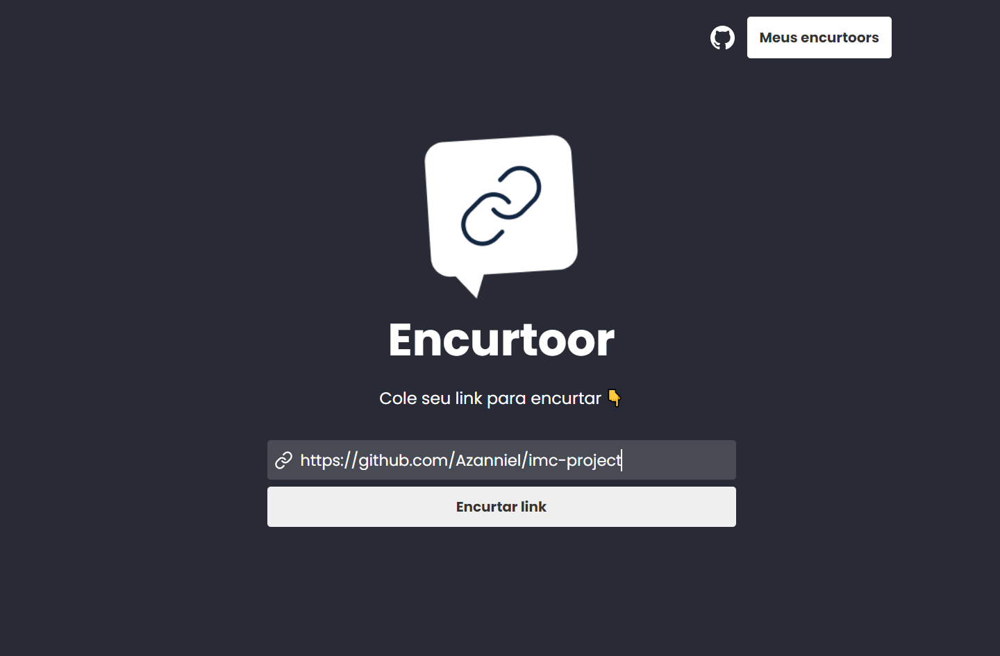
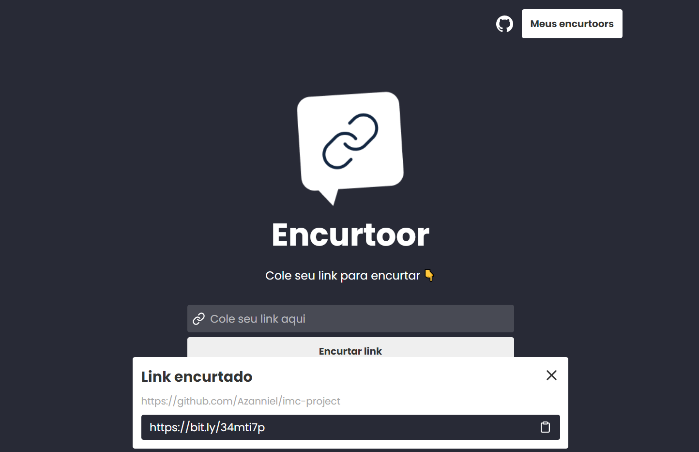
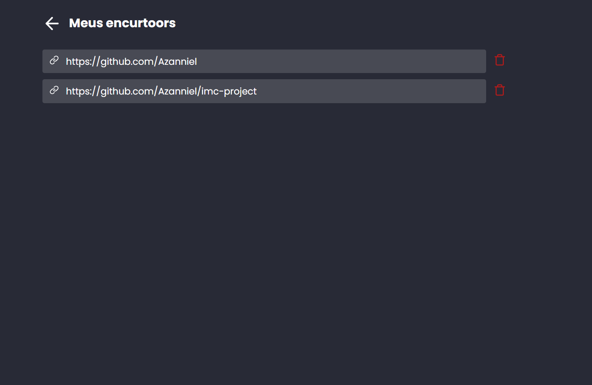
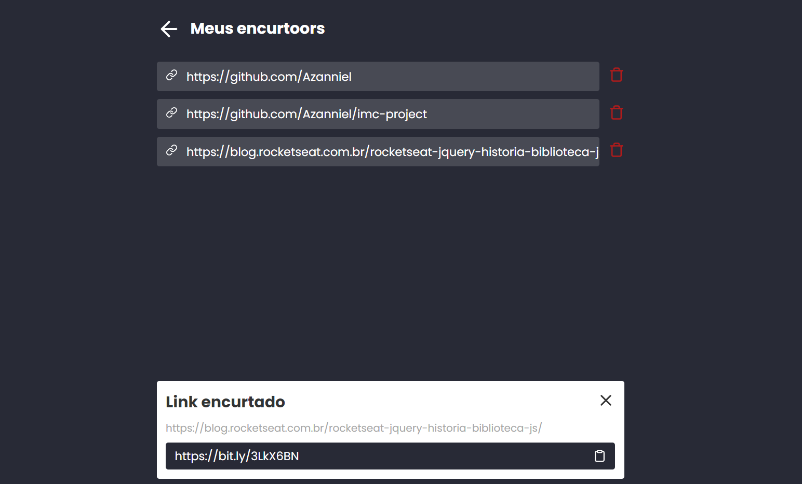

<div align="center">
  <div align="center">
    
  </div>

  <h2>Encurtoor</h2>

  <br>

  

  <br>

  > 🧐 Projeto para encurtar links feito durante o Evento Semana ReactJS.
</div>

<br>

## 🧪 Tecnologias

Esse projeto foi desenvolvido com as seguintes tecnologias:

- [React](https://reactjs.org)
- [Vite](https://vitejs.dev/)

## 🚀 Como executar

Clone o projeto e acesse a pasta do mesmo.

```bash
$ git clone https://github.com/Azanniel/encurtoor.git
$ cd encurtoor
```

*🔰 Atenção: Será necessário uma conta na plataforma https://bitly.com/ para garantir seu token de acesso que irá permitir encurtar os links!!*

Com seu token de acesso da **bitly** crie um arquivo na pasta raiz do projeto com o nome `.env.local` e dentro dele adicionei a chave como no exemplo abaixo no lugar da sequência de `x`:

```
VITE_BITLY_KEY=xxxxxxxxxxxxxxxxxxxxxxxxxxxx
```

Feito isso basta seguir os passos abaixo para executar o projeto:
```bash
# Instalar as dependências
$ yarn
# Iniciar o projeto
$ yarn dev
```

## 💻 Projeto

Encurtoor é uma aplicação para encurtar aquelas longas url's que tentamos acessar ou escrever de forma difícil em nosso navegador e nunca lembramos. Então o Encurtoor vem com essa proposta de ajudá-lo a encurtar o link e ainda guardá-lo para você no seu navegador.

<p align="center">
  
  
  
  
</p>

Este é um projeto desenvolvido durante a **[Semana React JS](https://www.youtube.com/watch?v=K-8YYSEYaB8&ab_channel=Sujeitoprogramador)**, iniciada no dia 31 de janeiro de 2021.

---

Rumo ao próximo nível 🚀 by Azanniel 👋🏻